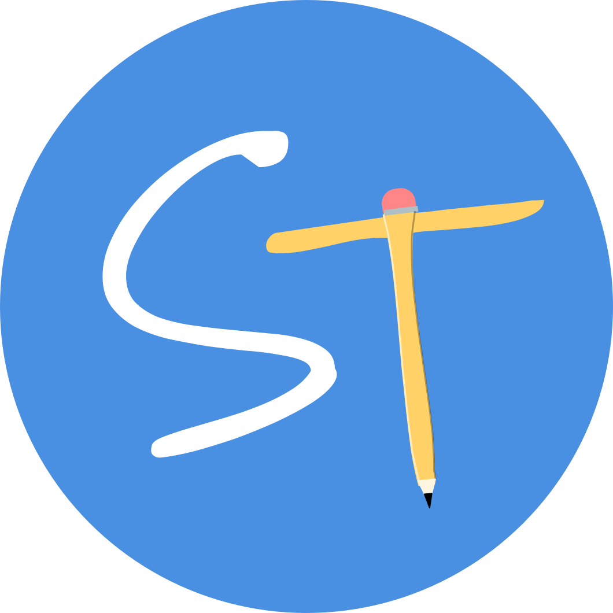

# Study Time ⏰

A modern, web-based study planner designed to help students manage their time and tasks effectively. Built with React and Vite for optimal performance and user experience.



## 📋 Table of Contents

- [Features](#features)
- [Tech Stack](#tech-stack)
- [Getting Started](#getting-started)
- [Installation](#installation)
- [Usage](#usage)
- [Project Structure](#project-structure)
- [Screenshots](#screenshots)
- [Contributing](#contributing)
- [License](#license)
- [Contact](#contact)

## ✨ Features

### 📅 Weekly Schedule Management
- Interactive calendar view with drag-and-drop functionality
- Color-coded subjects for easy visualization
- Add, edit, and remove study sessions
- Custom time slots and weekly recurring events

### ✅ Task List & Management
- Create tasks with due dates and subjects
- Categorized views (Today, This Week, Next Week, Later)
- Mark tasks as complete
- Search and filter by subject
- Priority indicators (Overdue, Due in X days)
- Persistent storage with localStorage

### 👤 User Profile & Settings
- Customizable profile (name, email, bio)
- Multiple avatar options (stock avatars or custom upload)
- Profile picture management
- Settings persist across sessions

### 🌓 Dark Mode Support
- Full dark mode implementation
- Smooth theme transitions
- Persistent theme preferences
- Optimized for both light and dark viewing

### 🎨 Modern UI/UX
- Clean, intuitive interface
- Responsive design (mobile, tablet, desktop)
- Toast notifications for user feedback
- Confirmation modals for important actions
- Accessible components

## 🛠 Tech Stack

### Frontend
- **React 18** - UI library
- **Vite** - Build tool and dev server
- **React Router** - Client-side routing
- **Tailwind CSS** - Utility-first styling
- **Lucide React** - Icon library

### Calendar & Date Management
- **react-big-calendar** - Calendar component
- **date-fns** - Date manipulation library
- **@mui/x-date-pickers** - Material-UI date/time pickers
- **@mui/material** - Material-UI components

### UI Components
- **react-hot-toast** - Toast notifications
- **react-color** - Color picker
- **Radix UI** - Accessible component primitives

### Storage
- **localStorage** - Client-side data persistence

## 🚀 Getting Started

### Prerequisites

- **Node.js** (v16 or higher)
- **npm** or **yarn** or **pnpm**

### Installation

1. **Clone the repository**
```bash
git clone https://github.com/yourusername/studytime.git
cd studytime